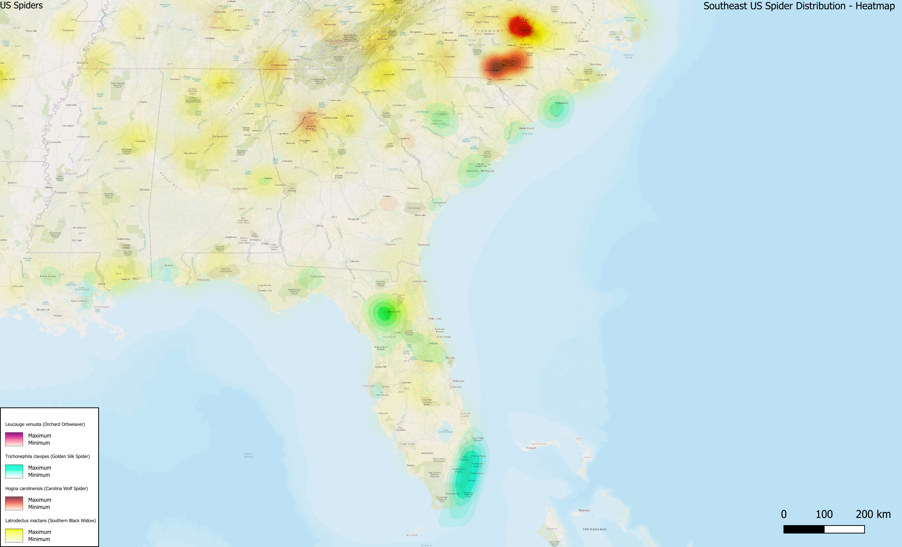
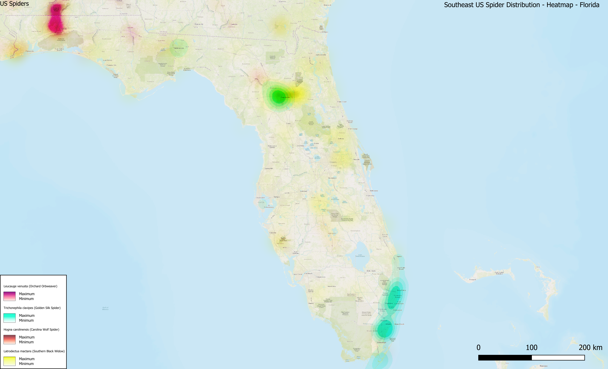
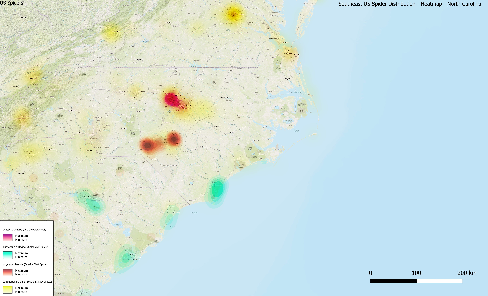
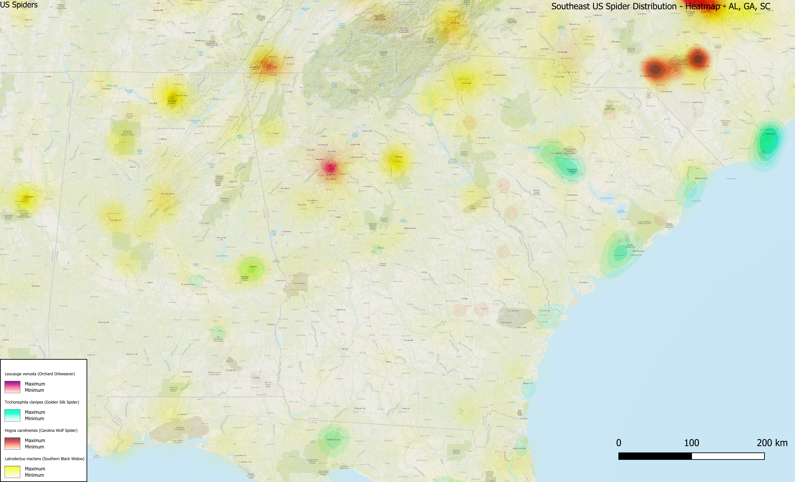

# GIS-Portfolio
Professional GIS portfolio project showcasing spatial ecology, GBIF occurrence data, and advanced QGIS cartography.
## Map Gallery

### Southeast US Master Layout

### Regional Close-Ups & Hotspots

## Cartographic Stack & Methodology
* **Software:** QGIS (configured for crisp 300 DPI exports)
* **Coordinate System:** EPSG:3857 (Web Mercator for seamless XYZ tile alignment)
* **Basemaps:** Professional topographic tiles via QuickMapServices
