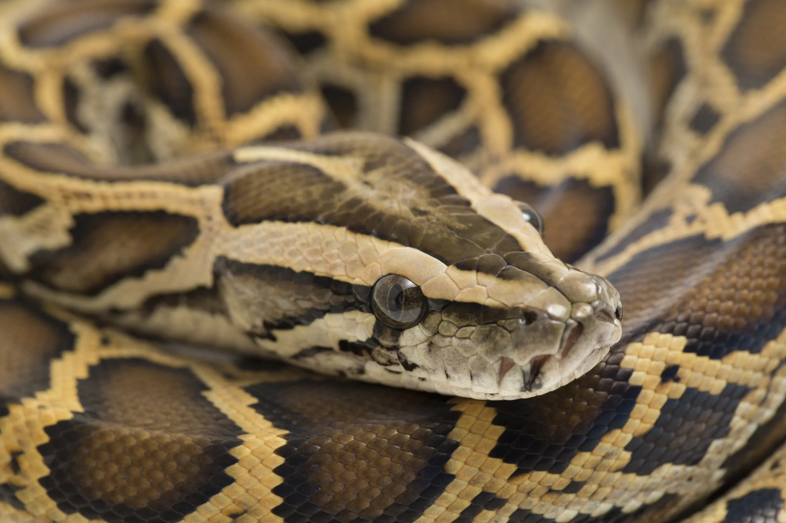
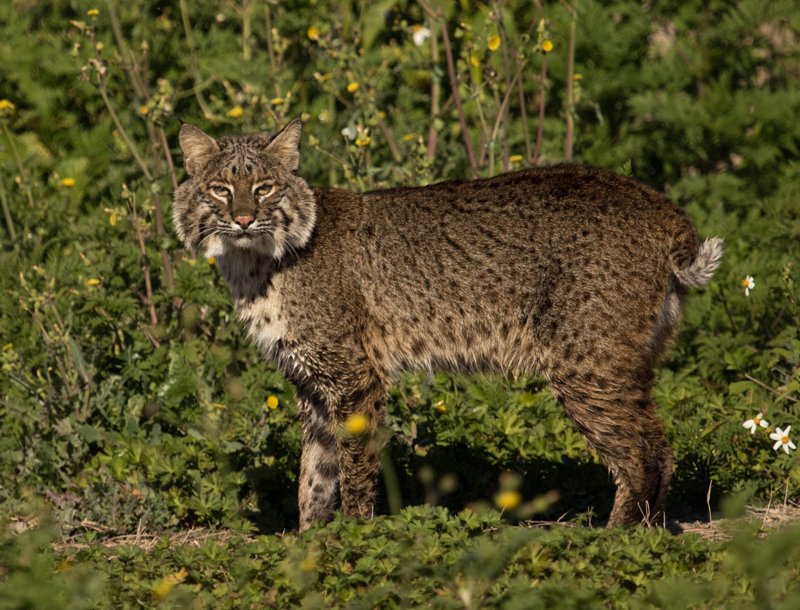
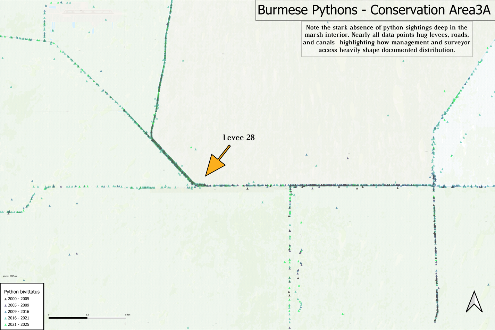
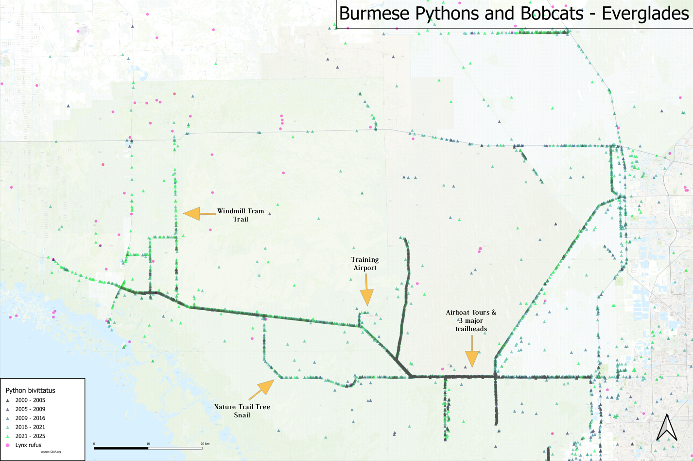

# Wildlife in the Everglades: What We Record vs. What We See

The Florida Everglades is home to a wide variety of wildlife, but the way we document different species can vary dramatically.

Burmese pythons and bobcats occupy the same broader South Florida landscape, yet their recorded observations create two very different maps.

This project explores that difference and asks a simple question:

**What can wildlife observation data tell us about the animals themselves — and about where and how we look for them?**

---

# Burmese Python

Burmese pythons have become one of the most closely documented invasive species in the Florida Everglades.

Their presence has generated extensive monitoring, research, reporting, and management efforts across South Florida.

But before looking at the data, it is important to remember that an observation map shows **where an animal has been recorded**, not necessarily everywhere that animal exists.

---

# Following the Python Record

Across South Florida, recorded Burmese python observations create a relatively extensive picture of the species.

The distribution of these observations is not uniform. Instead, concentrations appear across particular parts of the Everglades and surrounding landscape.

That raises an important question:

**Are we seeing the distribution of pythons, or the distribution of where people have been able to find and record them?**

---

# The Bobcat

Bobcats are native to Florida and share the broader South Florida landscape with Burmese pythons.

Yet the recorded observations look very different.

Compared with the python dataset, the bobcat observations are considerably more sparse.

The difference does not necessarily mean that bobcats are absent from areas where observations are missing. Instead, it highlights how differently the two species have been documented.

---

# Same Landscape, Different Record

To see the difference more clearly, both datasets can be viewed within the same area around Homestead and Everglades National Park.

The python observations create a much denser record across the landscape, while the bobcat observations are far less numerous.

The map is not showing us which animal is more abundant.

It is showing us that **the amount of recorded information about these two species is dramatically different.**

---

# Eight Points

Removing the python observations makes the difference even more apparent.

Within this same Homestead and Everglades National Park area, only **eight bobcat observations** are recorded.

Eight points cannot represent every location where a bobcat may live or travel.

What they do demonstrate is how limited the recorded dataset is compared with the much larger python record.

---

# The Bobcat

The lack of observations on a map does not necessarily mean the lack of an animal on the ground.

Wildlife datasets are influenced by many factors, including monitoring effort, accessibility, reporting, research priorities, funding, and how easily a species can be detected.

The difference between the python and bobcat datasets gives us an opportunity to examine those patterns more closely.

---

# Following the Python Data

Zooming into Conservation Area 3A reveals a concentration of recorded Burmese python observations around Levee 28.

The surrounding infrastructure provides important geographic context for the pattern of observations.

Rather than viewing the points independently, the landscape allows us to examine where recorded observations occur in relation to recognizable features.

---

# Ochopee

Further west, around Ochopee, the recorded python observations begin to thin out.

The pattern is visible without needing to force an explanation onto the map.

The important question is not simply where the observations decrease, but what factors may influence how much wildlife information is recorded in different parts of the landscape.

Accessibility, survey effort, reporting, detection, and monitoring priorities can all influence the final dataset.

---

# The Bigger Picture

Pulling back to the entire Everglades brings the two datasets together one final time.

Recorded Python observations form a much more extensive dataset, with noticeable concentrations around roads, levees, trailheads, airports, and other identifiable features across the landscape.

The bobcat record is far more limited by comparison.

Neither dataset provides a complete picture of where every individual animal actually lives.

Instead, these maps show **where these animals have been recorded**.

The contrast between them reveals something beyond the animals themselves.

It shows how wildlife data can reflect human attention, monitoring, accessibility, and priorities just as much as it reflects the landscape.

**In the Everglades, the map doesn't just show us where wildlife has been found. It also shows us where we've been looking.**
